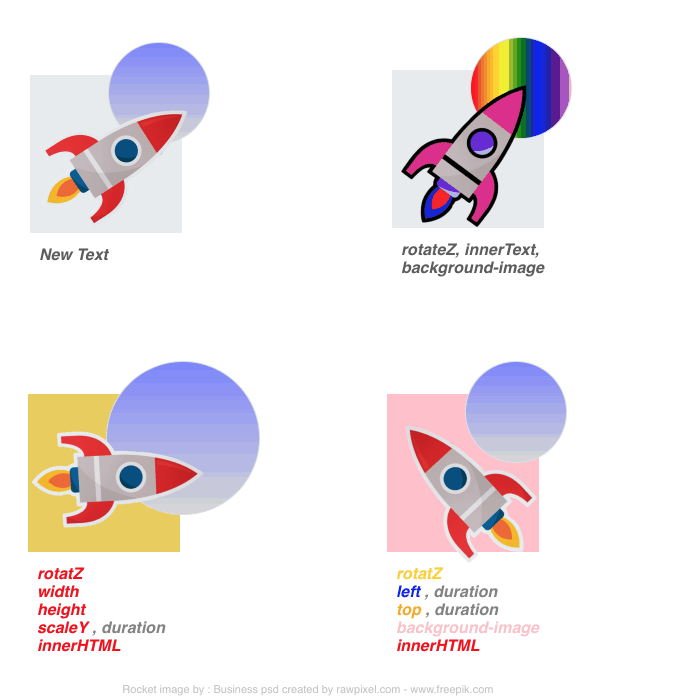

# Hype Symbol Override Extension
 Override Symbol Instance Properties

 

This Extension will run on Symbol Load.

Although Hype Symbol instances share all the same HTML properties, child elements , timelines etc.

It is often the case that you want each Symbol's instance to use different parameters when they appear on scene.

For example you may be using a Symbol to display different items in a cart or shop front. 

This extension gives you a way to easily override many of the Symbol instance's properties.

*Four instances of a single Symbol.*

With the Extension and on Symbol load.

 

 Individual Symbol instance properies can be overriden to allow each instance of the symbol to  be displayed differently and behave differently from each other at load time.

Each Symbol Instance can be assigned dataset key names  (*data-elementRef_*) and values. 

Any Symbol Instance's children that have the matching dataset key name will use the value to overide it's properties

Each dataset key name must only be used per child element. Any child element must have its own unique dataset key name.

The overriden properties can be normal css properties, hypeDocument.setElementProperty() properties or other HTML properties that can normally be set with javascript.

A Symbol Instance is an instance of a single Symbol on a scene and there can be many instances of the same Symbol on a scene.

You only have to set up the Symbol and its children elements once but you can add a new dataset key name and value at any time.

 A Symbol's child elements may have dataset key names (*data-elementRef_*) and values  but the Symbol Parent itself does not have to ;  have , use any or all of them.
Element dataset key names (*data-elementRef_*)   that are used, must match in the Parent Symbol

The datasets and value are entered  in the **Additional HTML Attributes** in Hype's Identity Panel

#### **Symbol data attributes:**

Symbol Dataset name and value to use for an override from the parent Symbol Instance.

#### 

**constructions**

*data-elementRef_propertyTag | value*

*data-elementRef_propertyTag | value,duration*

###### ***data-elementRef_propertyTag***

**data-**    : All names must start with this.

**elementRef_** : The arbitry name you give to refence an element. this does not have to match any real id you have given to the element.   Must end with <u>***underscore***</u>

**propertyTag**   :The name of the property. 

This should reflect in some part the real world property name so its intent is clear.

**value**  			:  The property value to pass in for the override.

**duration** 		:   The duration value for a hype API setElementProperty. 

This comes after the value and is separated by a comma. 			

  	

####  Some Symbol data attribute examples:

| data-elementRef_propertyTag | Value                                                        |
| :-------------------------- | :----------------------------------------------------------- |
| data-rect_url               | ${resourcesFolderName}/foo.png                               |
| data-text_bgcolor           | pink                                                         |
| data-rect1_width            | 400                                                          |
| data-rect1_height           | 400                                                          |
| data-rect1_url              | ${resourcesFolderName}/foo2.png                              |
| data-rect1_backgroundsize   | contain                                                      |
| data-rect1_backgroundrepeat | no-repea                                                     |
| data-rect_rotatez           | 20                                                           |
| data-text2_innertext        | foo other string  or words                                   |
| data-rect1_scalex           | 2,8                                                          |
| data-rect1_scaley           | 2,8                                                          |
| data-text_color             | rgb(233, 205, 85)                                            |
| data-text_innerhtml         | `Skateboarding` |
| data-text2_innerhtml        | Hello my lovely world                                        |
| data-square_zindex          | -20                                                          |
| data-text_innertext         | foo some string or words                                     |

####  Element data attribute:

Element's Dataset name and value to use to ACCEPT an override from the parent Symbol Instance

An element's **data-elementRef_propertyTag**   Must match a Parent Symbol's  *data-elementRef_propertyTag*  

**style** 						 :  Add 'style' property name at the beginning using (.) syntax, if the target property is a native css property. Do not use it for Hype 's *setElementProperty* API properties. 

**value** 	                     :  This value should be the real a Hype 's *setElementProperty* API property names ,a css property name or other HTML property name you wish to target. 

**Constructions**   

*data-elementRef_propertyTag | value*

*data-elementRef_propertyTag | style.value*    

####  Element data attribute examples:

| data-elementRef_propertyTag | Value                   |
| :-------------------------- | :---------------------- |
| data-rect_url               | background-image        |
| data-text_bgcolor           | style.backgroundColor   |
| data-rect1_width            | width                   |
| data-rect1_height           | height                  |
| data-rect1_url              | background-image        |
| data-rect1_backgroundsize   | style.background-size   |
| data-rect1_backgroundrepeat | style.background-repeat |
| data-rect_rotatez           | rotateZ                 |
| data-text2_innertext        | innerText               |
| data-rect1_scalex           | scaleX                  |
| data-rect1_scaley           | scaleY                  |
| data-text_color             | style.color             |
| data-text_innerhtml         | innerHTML               |
| data-text2_innerhtml        | innerHTML               |
| data-square_zindex          | z-index                 |
| data-text_innertext         | innerText               |

**Error handling.**

An error will occur if there is a mismatch in the dataset key names (*data-elementRef_*)  being used.

An error will be thrown in the console giving details and info to help find the mismatch.
 	Data for each error overide in a Symbol instance will be shown. 
 	**Symbol ID** 
 	**Mismatched key name** 
 	**Completed override data accepted** by the children elements 
 	**Expected overrides sent from** the Symbol to the children elements 

 

**print_debug** 

If **print_debug**  is on ( set to **true** ) The console will give the following data.

This is handy if you are not getting the values where you expect.

  Data for each fully Completed overide for a Symbol instance will be shown. 
 	**Symbol ID** 
 	**Completed override data accepted** by the children elements 
 	**Expected overrides sent from** the Symbol to the children elements 

You can also change  **print_debug**  to **false**  to turn it off

Code:

The code is placed in the Hype Documents Head file.

Place the **symbolOverride.js** file in the Hype resources panel, which will link it to the head 

