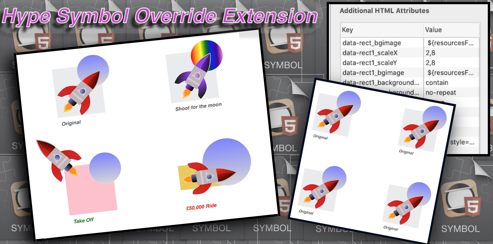
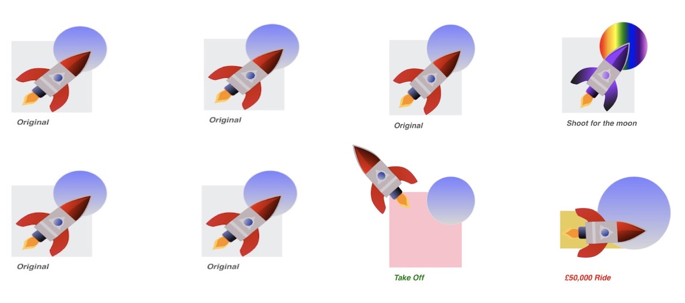

<strong>Thank You for your kind donation:</strong>
 
 

# Hype Symbol Override Extension
 Override Symbol Instance Properties

 

This Extension will run on Symbol Load (*HypeSymbolLoad*).

Although Hype Symbol instances share all the same HTML properties, child elements , timelines etc.

It is often the case that you want each Symbol's instance to use different parameters when they appear on scene.

For example you may be using a Symbol to display images and text but want different images and text in each.. 

Download the **symbolOverride.js** file above and place it you Hype Projects resources via the Resources panel.
Or use the current CDN link in your head file.

``

The extension will run on each Symbol at using the On Symbol load. You do not need to edit function  or use an action for this to happen.							

**Have a Look at the [Quick Start page](https://markhunte.github.io/Hype_Symbol_Override_Extension/) to see how it works.**

You can also find [Documentation](https://markhunte.github.io/Hype_Symbol_Override_Extension/docs.html)  here and linked on the Quick Start Page

 

This extension gives you a way to easily override many of a Symbol instance's child element's perameters/properties.

 

`History`

[Versions: v1.1.4](https://github.com/markhunte/Hype_Symbol_Override_Extension/releases/tag/v1.1.4)

*v1.1.4 changes. Put all Hype API properties in the exclude check. Must use css:propertyName when overriding css properties of same name.
 This Fixed an issue with a bug in the CSS.support method. The use of a 0 as a value for left,top returns true when it should return false.
 This result in top/left 0 values being resolved as valid css and bypassing the Hype API. a valid css should 0px. Using anything above 0 with no px
 returns false as expect.*

[version: v1.1.3p](https://cdn.jsdelivr.net/gh/markhunte/Hype_Symbol_Override_Extension@1.1.3/symbolOverride.js)

*Initial realease*

[All Releases](https://github.com/markhunte/Hype_Symbol_Override_Extension/releases)

