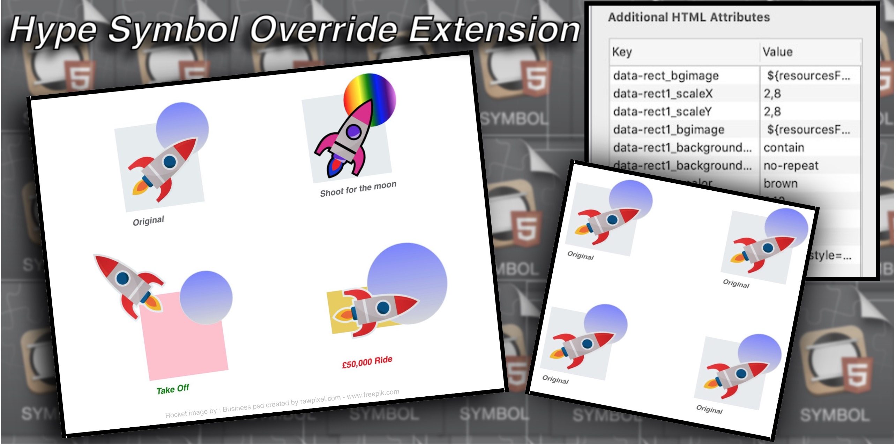

# Hype Symbol Override Extension
 Override Symbol Instance Properties

 

This Extension will run on Symbol Load (*HypeSymbolLoad*).


Although Hype Symbol instances share all the same HTML properties, child elements , timelines etc.

It is often the case that you want each Symbol's instance to use different parameters when they appear on scene.

For example you may be using a Symbol to display images and text but want different images and text in each.. 

<hr>

This extension gives you a way to easily override many of the Symbol instance's properties.


*Four instances of a single Symbol on a Scene.*


<hr>

With the Extension and on Symbol load.


 

<hr>


 Individual Symbol instance properties can be overriden to allow each instance of the symbol to  be displayed differently and behave differently from each other at load time.


Each Symbol's **child elements** can be assigned a target property type.

**hype:**

**css:**

**element:**

along withdataset key names  [***data-bindingName***] and [**Property**] names. 

When a Parent  Symbol **Instance**  has a matching ***data-bindingName*** to a child element and given a **value** the child element will use the **value** to overide it's targeted  **property**

The  property types hype:, css, element  will determine  how the override is applied. Either by Hype **hypeDocument.setElementProperty**() API, **css** property handles or **element** HTML property handles

Each *data-bindingName*  must only be used per  child element. 

The Child element must use its own unique ***data-bindingNames***.

For example, You may want to change the *Left* and *Top* of ***Rectangle 1*** and **Rectangle 2**.

You could use the *data-bindingName*s.

 **data-rect1left** and   **data-rect1top**

&

**data-rect2left** and ***data-rect2top***


The names are entirely up to you but must start with 'data-' and should reflect the target element and property name for easy understanding of intent and when looking back at it at a later time.


***Tip:***

<hr>

> *For readability : You may want to add an Underscore between the element ref and property ref in a data-bindingName.*
>
> *For example.*
>
> *instead of **data-react1bgimage** use **data-react1_bgimage***
>
> *Or you can use camel Hump  syntax.* 
>
> ***data-react1InnerText***
>
> *But note at run time the Capped letters are changed to lowercase. This is not an issue for this extension but may if you ever wanted to access the datasets from outside of it's scope should be noted.*

<hr>


The overriden properties can be normal **css** properties, **hypeDocument.setElementProperty**() properties or **Element** HTML  properties that can normally be set with javascript.

A Symbol Instance is an instance of a single Symbol on a scene and there can be many instances of the same Symbol on a scene.

You only have to set up a Symbol Instance and the Symbol child elements once but you can add a new data-bindingName and value at any time.

 A Symbol's child elements may have data-bindingNames and property names  but the Symbol Instance parent itself does not have to ;  have , use any or all of them.
If a Child Element's data-bindingName is to be used then there must be a matching data-bindingName in the Parent Symbol Instance for this to happen.


<hr>

 ###### A Symbol Instance  Element data-bindingName: `value`

*How Symbol Instance **data-bindingNames** and **values** are set to override Symbol Instance **child elements.***

 *Symbol instance* Element

The data-bindingNames  and values are entered  in the **Additional HTML Attributes** in Hype's Identity Panel as shown here


**constructions explained**

<hr>
data-bindingName | value

*data-bindingName | value,duration*

<hr>

###### The data-bindingName


**data-**    : All names must start with this.

**bindingName** : The arbitry name you give to refence an element. this does not have to match any real id you have given to the element.  But should reflect in some part the symbols target child element and real world property name so its intent is clear.


###### The **Value**:

**value**  			:  The property value to pass in for the override.

**duration** 		:   The duration value for a hype API setElementProperty. (optional)

This comes after the value and is separated by a comma. 

The duration value is here for completeness in reflection of the setElementProperty API usage.

In most cases you will do any animaions on elements using the normal means within hype.

But adding a duration here will also allow for the same type of animation afforded to using the setElementProperty in an Hype function.  (see example 2)


​			

<hr>  	

####  Some Examples of Symbol instance element data-bindingNames and values


| data-bindingName           | Value                                                        |
| :------------------------- | :----------------------------------------------------------- |
| data-rectbgimage           | ${resourcesFolderName}/foo.png                               |
| data-textbgcolor           | pink                                                         |
| data-rect1width            | 400                                                          |
| data-rect1height           | 400                                                          |
| data-rect1bgimage          | ${resourcesFolderName}/foo2.png                              |
| data-rect1backgroundsize   | contain                                                      |
| data-rect1backgroundrepeat | no-repeat                                                    |
| data-rectrotatez           | 20                                                           |
| data-text2innertext        | foo other string  or words                                   |
| data-rect1scalex           | 2,8                                                          |
| data-rect1scaley           | 2,8                                                          |
| data-textcolor             | rgb(233, 205, 85)                                            |
| data-textinnerhtml         | `<span style="color:gold;font-weight:bold">Skateboarding</span>` |
| data-text2innerhtml        | Hello my lovely world                                        |
| data-squarezindex          | -20                                                          |
| data-textinnertext         | foo some string or words                                     |


<hr>
T


#### *The symbols*  > **Child Elements**  : **data-bindingName  : property**

How Child Element's **data-bindingNames** and **property** names are set to ACCEPT an override from it's parent Symbol Instance

Child element inside a Symbol


The data-bindingNames  and property names are entered  in the **Additional HTML Attributes** in Hype's Identity Panel as shown here


<hr>

**Constructions**  **explained** 

data-bindingName | *PropertyType: property*

<hr>

An element's **data-bindingName**  **Property** names 

( The Parent Symbol **Instance**  would need to include the same *data-bindingName* as this child's *data-bindingName* if required for that instance's use )

 

**PropertyType:**						 :  Use  the property type at the beginning followed by a colon **:**  

For an element's property that a **hypeDocument.setElementProperty**() API  can be used to set it, use:

 **hype:**

For an element's **css**  property, ones that the **hypeDocument.setElementProperty**() API  can not set use:

**css:**

For a element's  property, like innerHtml  use:

**element:**


<hr>

####  Some Examples of  Symbol instance > Child element :  data-bindingName


| data-bindingName           | Property type : Value   |
| :------------------------- | :---------------------- |
| data-rectbgimage           | hype : background-image |
| data-textbgcolor           | css : backgroundColor   |
| data-rect1width            | hype: width             |
| data-rect1height           | hype: height            |
| data-rect1bgimage          | hype: background-image  |
| data-rect1backgroundsize   | css: background-size    |
| data-rect1backgroundrepeat | css: background-repeat  |
| data-rectrotatez           | hype: rotateZ           |
| data-text2innertext        | element: innerText      |
| data-rect1scalex           | hype: scaleX            |
| data-rect1scaley           | hype: scaleY            |
| data-textcolor             | css: color              |
| data-textinnerhtml         | element: innerHTML      |
| data-text2innerhtml        | eleement: innerHTML     |
| data-squarezindex          | hype: z-index           |
| data-textinnertext         | element: innerText      |


<hr>


**Error handling.**

An error will occur if there is a mismatch in the data-bindingName being used.

An error will be thrown in the console giving details and info to help find the mismatch.
 	Data for each error overide in a Symbol instance will be shown.<br>
 	**Symbol ID**<br>
 	**Mismatched *data-bindingName***<br>
 	**Completed overrides** data-bindingnames and values accepted  by the children elements<br>
 	**Symbol Instance Overrides Expected** sent from  the Symbol to the children elements<br>

 


<hr>


**print_debug** 

If **print_debug**  is on ( set to **true** ) the console will give the following data.  The default is false

This is handy if you are not getting the values where you expect.

  Data for each fully Completed overide for a Symbol instance will be shown.<br>
 	**Symbol ID**<br>
 	**Completed overrides** data-bindingnames and values accepted by the children elements<br>
 	**Symbol Instance Overrides Expected** sent from the Symbol to the children elements<br>

To change . ( see below for more  **1* )


<hr>


Code:

The code is placed in the Hype Documents Head file.

Place the **symbolOverride.js** file in the Hype resources panel, which will link it to the head 

Hype Example  included in download


<hr>


*1

The **print_debug**  can be either turned on/off by going into the code and changeing the line

print_debug = false or true.

The default is false.

Alternatively you can add a special Hype Function to your project (**Not inside a symbol**)

The hype functions  MUST be named  **stem**

Inside the stem() function you can add the line

**print_debug = true**

You do not need to set the stem() function to run via any action. The  Hype Symbol Override Extension will run the stem function for each symbol instance if the stem() function exists.


###### Hype stem function


```
// element - DOMHTMLElement that triggered this function being called

// event - event that triggered this function being called*

function stem(hypeDocument, element, event) {

 
    print_debug = true

}
```

 


